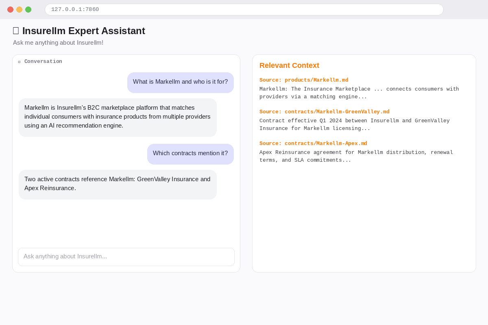
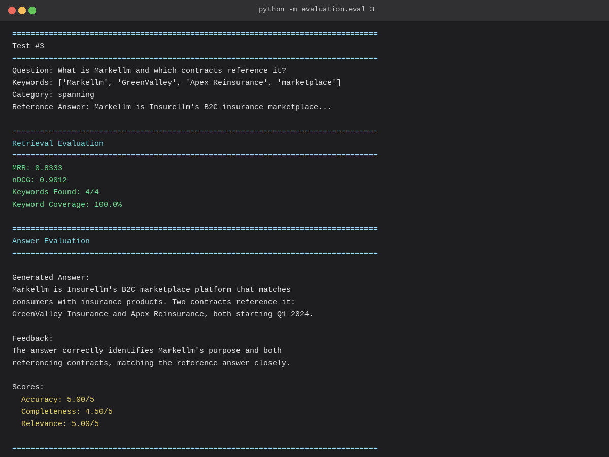

# InsureLLM RAG Assistant 🏢🔍

A retrieval-augmented generation (RAG) assistant for **Insurellm**, a fictional insurance technology company. Employees can ask natural-language questions and get answers grounded in the company's own knowledge base — products, contracts, and employee records — with a basic and an advanced ("pro") implementation to compare RAG techniques.

## Overview

The project is built in stages:

1. **Vector database setup** — load markdown documents from `knowledge-base/`, chunk them, embed them, and store them in a Chroma vector store.
2. **Basic RAG** — a straightforward LangChain retrieve-then-generate pipeline, served through a Gradio chat UI (`app.py`) that shows the retrieved context alongside each answer.
3. **Evaluation** — a test set of question/answer/keyword triples (`evaluation/tests.jsonl`) scored with retrieval metrics (MRR, NDCG, keyword coverage) and an LLM-as-a-judge for accuracy, completeness, and relevance.
4. **Advanced ("pro") RAG** — a from-scratch implementation with LLM-based semantic chunking (headline + summary + original text per chunk), query rewriting, dual retrieval (original + rewritten query), and LLM re-ranking of retrieved chunks before generation.

## Application Preview

### Chat Interface

<p align="center">
  
</p>

### Terminal Output

<p align="center">
  
</p>

## Files

| File / Folder | Description |
|---|---|
| `vector_database_setup.ipynb` | Builds the Chroma vector database from the knowledge base — loading, chunking, and embedding documents. |
| `rag_with_langchain.ipynb` | Walks through the basic LangChain RAG pipeline interactively. |
| `rag_evaluation.ipynb` | Interactive walkthrough of the evaluation test set and metrics. |
| `advanced_rag_assistant.ipynb` | Interactive walkthrough of the advanced RAG techniques (chunking, query rewriting, re-ranking). |
| `app.py` | Gradio chat app entry point — runs the assistant with a live "Retrieved Context" panel next to the conversation. |
| `implementation/ingest.py` | Basic ingestion: loads markdown from `knowledge-base/`, splits with `RecursiveCharacterTextSplitter`, embeds with OpenAI, stores in Chroma (`vector_db/`). |
| `implementation/answer.py` | Basic RAG answer pipeline — retrieves top-k chunks and generates a response with `gpt-4.1-nano`. |
| `pro_implementation/ingest.py` | Advanced ingestion: an LLM splits each document into semantically meaningful, overlapping chunks (headline + summary + original text) in parallel, then embeds and stores them in a separate Chroma store (`preprocessed_db/`). |
| `pro_implementation/answer.py` | Advanced RAG answer pipeline — rewrites the user's query, retrieves with both the original and rewritten query, merges and re-ranks chunks with an LLM, then generates the final answer. |
| `evaluation/tests.jsonl` | Test questions with expected keywords, reference answers, and categories (direct fact, spanning, temporal, etc.). |
| `evaluation/test.py` | Loads and validates test questions from `tests.jsonl`. |
| `evaluation/eval.py` | Scores retrieval (MRR, NDCG, keyword coverage) and uses an LLM judge to rate answer accuracy, completeness, and relevance. |
| `knowledge-base/` | Markdown source documents: `company/` (about, careers, culture, overview), `products/` (8 InsureLLM product lines), `contracts/` (customer contracts per product), `employees/` (employee profiles). |
| `requirements.txt` | Python dependencies for the project environment. |

## Key Concepts Covered

- **RAG fundamentals**: chunking, embeddings, vector search, and retrieval-augmented generation with LangChain + Chroma
- **Two implementations side by side**: a simple baseline (`implementation/`) vs. a more sophisticated pipeline (`pro_implementation/`) — useful for comparing techniques and their impact on answer quality
- **Semantic chunking**: using an LLM to split documents into meaningful, overlapping chunks instead of naive fixed-size splitting
- **Query rewriting & re-ranking**: rewriting the user's question for better retrieval, querying with both versions, and having an LLM re-rank the merged results
- **RAG evaluation**: combining classic IR metrics (MRR, NDCG, keyword coverage) with LLM-as-a-judge scoring for a fuller picture of quality
- **Gradio UI with context transparency**: showing users exactly which knowledge-base chunks were used to generate each answer

## Setup

```bash
pip install -r requirements.txt
```

Create a `.env` file with the API key(s) your chosen implementation needs (e.g. `OPENAI_API_KEY`, and `GROQ_API_KEY` if using the pro implementation's Groq-hosted model).

Build the vector database first (choose one):

```bash
python -m implementation.ingest        # basic pipeline -> vector_db/
python -m pro_implementation.ingest    # advanced pipeline -> preprocessed_db/
```

Then run the assistant:

```bash
python app.py
```

Vector databases are intentionally excluded from the repo — rebuild them from `knowledge-base/` using the ingestion scripts above before running the app.

## Evaluation

Run the test suite against your chosen implementation to score retrieval and answer quality:

```bash
python -m evaluation.eval
```

Test cases in `evaluation/tests.jsonl` span multiple categories (direct fact, spanning multiple documents, temporal reasoning) so scores reflect performance across different question types, not just simple lookups.
